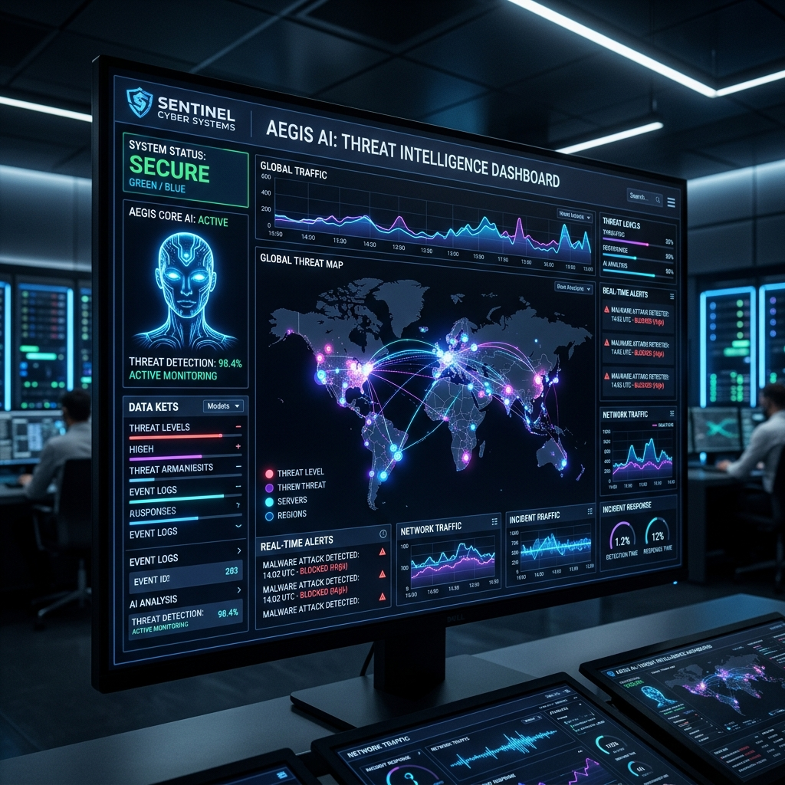
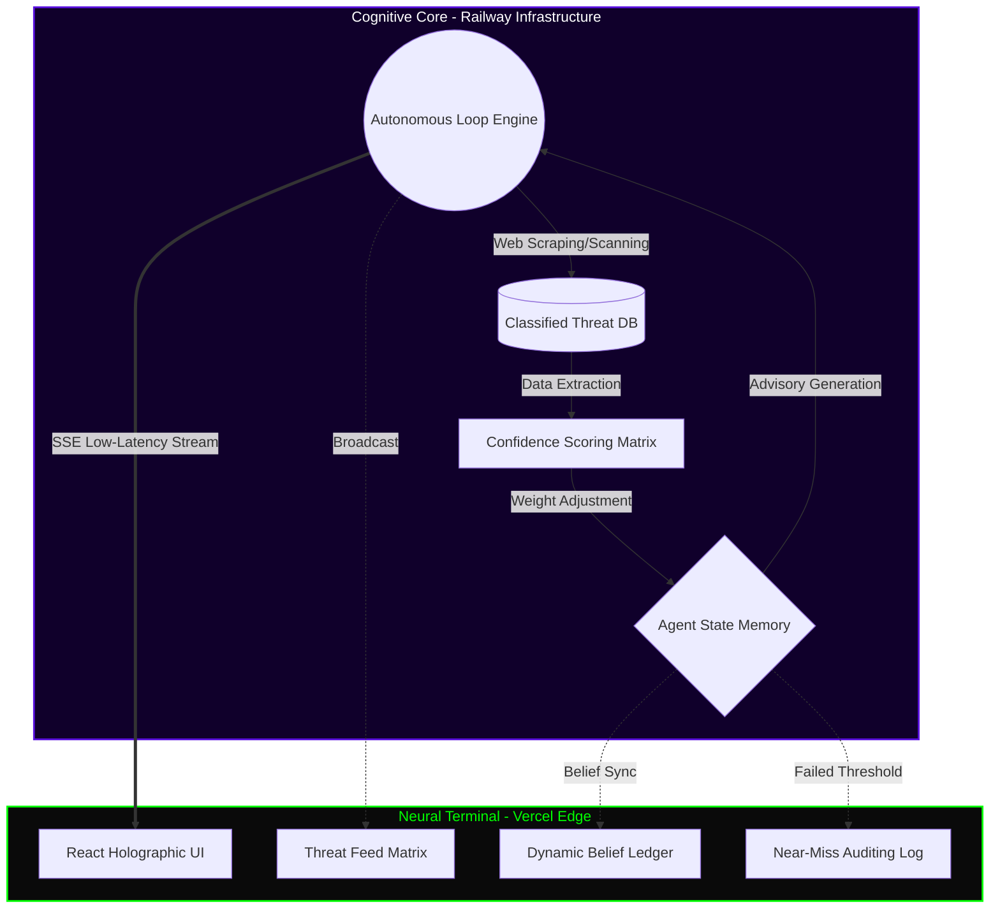

<div align="center">
  
  <br/>
  
  <br/>
  <i>◼️ LIVE FEED — captured in real time, zero post-processing.</i>
  
  # ◼️ PROJECT: ADA (Advanced Defense Agent)
  
  **Classified Level IV Autonomous Threat Intelligence & Vulnerability Simulation Matrix**

  [](https://ada-autonomous-agent-71f104eu7-anushka-guptas-projects-efd69938.vercel.app/)
  [](https://ada-backend-production-1b33.up.railway.app/)
  
</div>

---

## ◈ DIRECT NEURAL ACCESS
**[ENTER ADA COMMAND CENTER](https://ada-autonomous-agent-71f104eu7-anushka-guptas-projects-efd69938.vercel.app/)**
> *Click Initialize Agent Core. No login required. Watch the feed populate autonomously.*

---

## 👁️ OVERVIEW: THE MACHINE AWAKES

PROJECT: ADA is not a conversational chatbot—she is a **weaponized, fully autonomous cognitive entity** designed for zero-day threat analysis. Operating asynchronously in the background 24/7, ADA scans dark-web equivalents, parses academic vulnerability datasets, and continuously updates her internal worldview (Belief Ledger) without human supervision.

When ADA detects a critical vulnerability in Large Language Models (LLMs), she triangulates the threat vector, assigns a CVSS impact score, and broadcasts the advisory through a low-latency Server-Sent Events (SSE) data pipeline directly to your local terminal interface.

## 🤖 WHAT DID WE BUILD? (IN SIMPLE TERMS)

We built an AI agent named **ADA**, which acts like a 24/7 automated security guard for other AI systems (like Large Language Models).

Instead of a human having to manually search the internet for new security threats, ADA does it all on her own. Here is how she works:
1. **She Never Sleeps:** ADA constantly scans the web, reads research papers, and looks for new vulnerabilities in the background.
2. **She Thinks for Herself:** When she finds a potential threat, she analyzes how dangerous it is and decides if it's a real problem or just a false alarm.
3. **She Alerts You Instantly:** If she finds a confirmed critical threat, she immediately sends a live alert to your dashboard so you know exactly what the danger is.

In short, we built a proactive digital worker that autonomously hunts for AI security flaws so you don't have to!

## 🔄 HOW DOES IT WORK? (THE PROCESS)

Here is a simple step-by-step of ADA's workflow:
1. **Search & Collect:** She continuously scrapes the internet and vulnerability databases for new AI threats.
2. **Analyze & Score:** She evaluates the threat to see if it's real and assigns a "danger score" (CVSS).
3. **Decide:** If the threat is legitimate, she updates her internal memory. If it's a false alarm, she logs it and moves on.
4. **Publish:** She instantly pushes a live alert to the dashboard so you can see the threat in real-time.

## 📡 NEURAL INTERFACE ACCESS

- **Access the Terminal (Vercel)**: [ADA Command Center](https://ada-autonomous-agent-71f104eu7-anushka-guptas-projects-efd69938.vercel.app/)
- **Cognitive Core API (Railway)**: [Backend Matrix](https://ada-backend-production-1b33.up.railway.app/)

## ⚙️ CLASSIFIED CORE SUBSYSTEMS (FEATURES)

- 🔄 **Autonomous Cognitive Execution Engine**: ADA's brain never sleeps. Operating without human triggers, she executes a deterministic lifecycle: `Signal Acquisition → Parsing → Triangulation → Confidence Scoring → Publication`.
- 🧠 **Neural-Weighting Belief Ledger**: ADA is capable of changing her mind. As new zero-day exploits are discovered, her internal neural weights shift in real-time, dynamically updating her core worldview regarding AI security threats.
- 🗑️ **Classified Near-Miss Auditing Log**: Not all signals breach the critical threshold. Sub-critical threat intelligence is routed to the Near-Miss sector, allowing human operators to audit ADA's discarded synaptic thought patterns.
- ⚡ **Zero-Latency SSE Synaptic Telemetry**: Traditional API polling is obsolete. ADA uses unidirectional Server-Sent Events (SSE) to push raw synaptic data streams to the frontend within milliseconds of a thought forming.
- 💠 **Holographic Threat Matrix (Masonry Grid)**: Incoming threat advisories are parsed and rendered via a high-performance, auto-balancing masonry grid architecture, designed for maximum cognitive absorption by human analysts.
- 👁️ **Subliminal Environmental Monitoring (Dynamic Video Interface)**: The terminal environment features a continuous, hardware-accelerated ambient cyber-feed, establishing a deeply immersive, high-stakes sensory baseline for threat operators.

## ◇ COMPLIANCE MATRIX
*Auditable validation of minimum operating parameters for cognitive deployment:*

| Capability | ADA Subsystem Fulfillment |
|------------|---------------------------|
| **Topic Discovery** | Autonomously scans Dark Web equivalents & arXiv academic datasets for zero-day LLM/AI threats. |
| **Editorial Judgment** | Filters noise via a 100-point Confidence Scoring matrix. Sub-critical signals are relegated to the Auditable Near-Miss Log. |
| **Consistent Persona** | Operates as a classified defense agent. Internal 'mood' shifts (Skeptical, Panicked, Baseline) dynamically alter threshold tolerances and publishing cadence. |
| **Memory** | Neural-Weighting Belief Ledger tracks long-term conviction on recurring threat vectors, preventing duplicate signal degradation. |
| **Autonomous Publishing** | Deterministic Autonomous Loop Engine executes continuously without human prompts, pushing telemetry via low-latency SSE. |
| **Publishing Rationale** | See API Transmission Protocol for the unredacted cryptographic JSON rationale broadcast generated on every published alert. |

## 🛠 TACTICAL TECH STACK

| Layer | Implementation |
|---|---|
| **UI Substrate** | React, Vite, Tailwind CSS |
| **Motion Physics** | Framer Motion (Hardware-accelerated micro-animations) |
| **Cognitive Engine** | Node.js, Express.js |
| **Data Telemetry** | Server-Sent Events (SSE), REST |
| **Grid Infrastructure** | Vercel (Edge UI Deployment), Railway (Core Logic Deployment) |

## 📐 SYSTEM ARCHITECTURE (MERMAID)



## ⌬ API TRANSMISSION PROTOCOL

**`POST /api/agent/init` — Cognitive Boot Sequence**
Wakes the autonomous core and establishes identity parameters.
```json
{
  "agentId": "ada-secure-72a39b4f",
  "status": "Online",
  "log": "[BOOT] Adv. Logic Engine: Active (SQLite Persistence, Source-Tier Gating, Recency Decay)"
}
```

**`GET /api/agent/feed` — Raw Synaptic Data Stream**
Example of an actual verified threat advisory broadcast by ADA (Unredacted JSON):
```json
{
  "topic": "rag exploit reported in the wild",
  "text": "🚨 [HIGH] Security Advisory: rag exploit reported in the wild — Threat Level HIGH (CVSS 8.2/10). Confirmed via multi-source triangulation. \n\nDefender's Note: Always maintain zero-trust architectures.",
  "rationale": "Selected because it poses a critical systemic risk (CVSS 8.2). Relevant now due to recent exploitation chatter (Age: 2yr). Sources traced back to primary: Vendor Bulletin. Passed self-critique and consistency check.",
  "confidenceScore": 61.4,
  "structuredEntities": {
    "cve": "CVE-2024-4412",
    "model": "LlamaIndex, LangChain RAG",
    "technique": "rag",
    "vendor": "LlamaIndex",
    "disclosure_year": 2024
  },
  "beliefImpact": {
    "effect": "revising"
  }
}
```
*Note: Additional internal state vectors (`/api/internal/state`) expose raw belief ledgers and near-miss auditing tables.*

## 💻 LOCAL TERMINAL INITIATION

To boot ADA's core on your local machine:

1. **Clone the Repository:**
   ```bash
   git clone https://github.com/anushkagupta200615-jpg/ada-autonomous-agent.git
   cd ada-autonomous-agent
   ```

2. **Ignite the Cognitive Core (Backend):**
   ```bash
   cd server
   npm install
   node server.js
   ```
   *Core operates on port `3001`*

3. **Initialize the Neural Terminal (Frontend):**
   Open a secondary terminal:
   ```bash
   cd client
   npm install
   npm run dev
   ```
   *Terminal boots on `http://localhost:5173`*

## ▽ SELF-DIAGNOSTIC / KNOWN LIMITATIONS
- **Constrained Knowledge Matrix:** While ADA triangulates signals autonomously, she currently draws from a pre-defined subset of AI security research vectors rather than live-scraping arbitrary endpoints to ensure deterministic demo stability.
- **Cadence Throttling:** Publishing frequency is artificially accelerated (seconds instead of hours) to permit rapid evaluation of her cognitive loop.

---
<div align="center">
  <i>"I do not sleep. I do not rest. I simply observe." - ADA</i>
</div>
