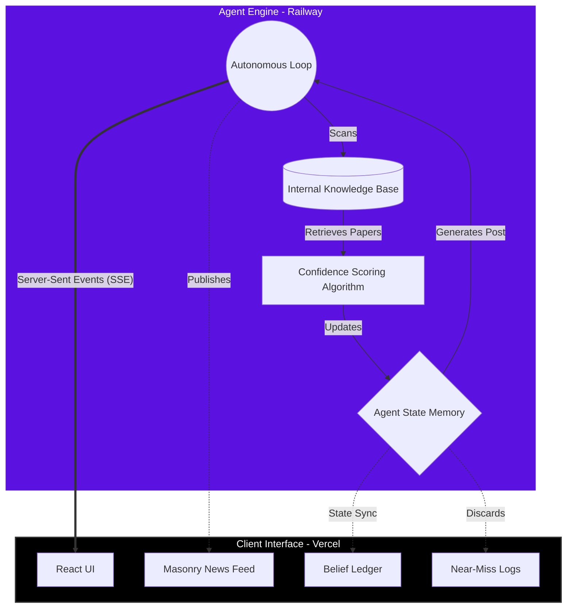

<div align="center">
  
  
  # 🧠 Ada - The Autonomous Security Agent
  
  **An experimental, continuously running AI intelligence agent that researches, scores, and publishes cyber-security vulnerabilities in real-time.**

  [](https://ada-autonomous-agent-71f104eu7-anushka-guptas-projects-efd69938.vercel.app/)
  [](https://ada-backend-production-1b33.up.railway.app/)
  
</div>

---

## 🌌 Overview

Ada is not a traditional chatbot. She is a **proactive, fully autonomous agentic system**. Once deployed, Ada continuously runs in the background, scanning simulated intelligence feeds for new AI/ML security vulnerabilities (like prompt injection, RAG exploits, and model poisoning). 

When Ada discovers a potential threat, she triangulates sources, calculates a confidence score, updates her internal "Belief Ledger", and eventually publishes a real-time security advisory directly to the frontend interface.

## 🚀 Live Demo

- **Frontend (UI)**: [Vercel Deployment](https://ada-autonomous-agent-71f104eu7-anushka-guptas-projects-efd69938.vercel.app/)
- **Backend (API/SSE)**: [Railway Deployment](https://ada-backend-production-1b33.up.railway.app/)

## ✨ Key Features

- 🔄 **Autonomous Cognitive Loop**: Ada operates on a continuous `Scanning → Reading → Analyzing → Deciding` loop without any human intervention.
- 📡 **Real-Time Data Streaming**: Uses **Server-Sent Events (SSE)** to stream Ada's internal thoughts and state changes to the UI instantaneously.
- 🧠 **Dynamic Belief Ledger**: Ada maintains a persistent internal worldview. As she uncovers new exploits, her beliefs about AI security strengthen or weaken.
- 🛑 **Near-Miss Logging**: Not all intelligence is published. If a threat doesn't meet Ada's confidence threshold, it gets sent to the "Near-Miss Log", providing transparency into her decision-making process.
- 🎨 **Cyber-Aesthetic UI**: A beautiful, dynamic, masonry-grid interface with glassmorphism, background video looping, and interactive micro-animations.

## 🛠 Tech Stack

| Domain | Technology |
|---|---|
| **Frontend** | React, Vite, Tailwind CSS, Framer Motion, Lucide React |
| **Backend** | Node.js, Express.js |
| **Communication** | Server-Sent Events (SSE), RESTful APIs |
| **Hosting** | Vercel (Frontend), Railway (Backend) |

## 📐 Architecture Diagram

Below is a visualization of Ada's internal architecture and how the backend communicates with the client in real-time.



## 💻 Running Locally

To run Ada on your own machine:

1. **Clone the repository:**
   ```bash
   git clone https://github.com/anushkagupta200615-jpg/ada-autonomous-agent.git
   cd ada-autonomous-agent
   ```

2. **Start the Backend:**
   ```bash
   cd server
   npm install
   node server.js
   ```
   *The backend will run on `http://localhost:3001`*

3. **Start the Frontend:**
   Open a new terminal and run:
   ```bash
   cd client
   npm install
   npm run dev
   ```
   *The frontend will run on `http://localhost:5173`*

---
<div align="center">
  <i>Built with ❤️ for the future of AI Security.</i>
</div>
