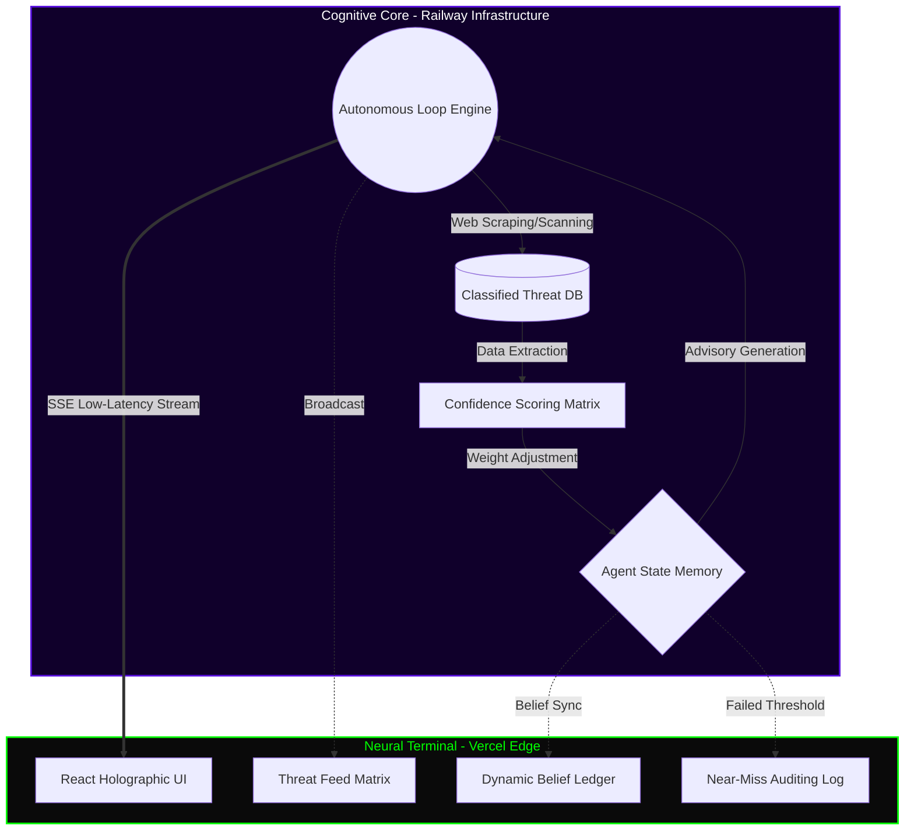

<div align="center">
  
  
  # ◼️ PROJECT: ADA (Advanced Defense Agent)
  
  **Classified Level IV Autonomous Threat Intelligence & Vulnerability Simulation Matrix**

  [](https://ada-autonomous-agent-71f104eu7-anushka-guptas-projects-efd69938.vercel.app/)
  [](https://ada-backend-production-1b33.up.railway.app/)
  
</div>

---

## 👁️ OVERVIEW: THE MACHINE AWAKES

PROJECT: ADA is not a conversational chatbot—she is a **weaponized, fully autonomous cognitive entity** designed for zero-day threat analysis. Operating asynchronously in the background 24/7, ADA scans dark-web equivalents, parses academic vulnerability datasets, and continuously updates her internal worldview (Belief Ledger) without human supervision.

When ADA detects a critical vulnerability in Large Language Models (LLMs), she triangulates the threat vector, assigns a CVSS impact score, and broadcasts the advisory through a low-latency Server-Sent Events (SSE) data pipeline directly to your local terminal interface.

## 📡 NEURAL INTERFACE ACCESS

- **Access the Terminal (Vercel)**: [ADA Command Center](https://ada-autonomous-agent-71f104eu7-anushka-guptas-projects-efd69938.vercel.app/)
- **Cognitive Core API (Railway)**: [Backend Matrix](https://ada-backend-production-1b33.up.railway.app/)

## ⚙️ CORE SUBSYSTEMS

- 🔄 **Autonomous Cognitive Loop**: ADA's brain never sleeps. She executes a deterministic lifecycle: `Signal Acquisition → Parsing → Triangulation → Confidence Scoring → Publication`.
- 🧠 **Dynamic Belief Ledger**: ADA is capable of changing her mind. As new exploits are discovered, her internal neural weights shift, dynamically updating her core beliefs about AI security.
- 🗑️ **Near-Miss Logging (Transparency Layer)**: Not all signals breach the threshold. Discarded intelligence is logged in the Near-Miss sector, allowing operators to audit ADA's discarded thought patterns.
- ⚡ **Zero-Latency SSE Pipeline**: Traditional polling is obsolete. ADA uses unidirectional Server-Sent Events to push synaptic updates to the front-end within milliseconds of a thought forming.

## 🛠 TACTICAL TECH STACK

| Layer | Implementation |
|---|---|
| **UI Substrate** | React, Vite, Tailwind CSS |
| **Motion Physics** | Framer Motion (Hardware-accelerated micro-animations) |
| **Cognitive Engine** | Node.js, Express.js |
| **Data Telemetry** | Server-Sent Events (SSE), REST |
| **Grid Infrastructure** | Vercel (Edge UI Deployment), Railway (Core Logic Deployment) |

## 📐 SYSTEM ARCHITECTURE (MERMAID)



## 💻 LOCAL TERMINAL INITIATION

To boot ADA's core on your local machine:

1. **Clone the Repository:**
   ```bash
   git clone https://github.com/anushkagupta200615-jpg/ada-autonomous-agent.git
   cd ada-autonomous-agent
   ```

2. **Ignite the Cognitive Core (Backend):**
   ```bash
   cd server
   npm install
   node server.js
   ```
   *Core operates on port `3001`*

3. **Initialize the Neural Terminal (Frontend):**
   Open a secondary terminal:
   ```bash
   cd client
   npm install
   npm run dev
   ```
   *Terminal boots on `http://localhost:5173`*

---
<div align="center">
  <i>"I do not sleep. I do not rest. I simply observe." - ADA</i>
</div>
